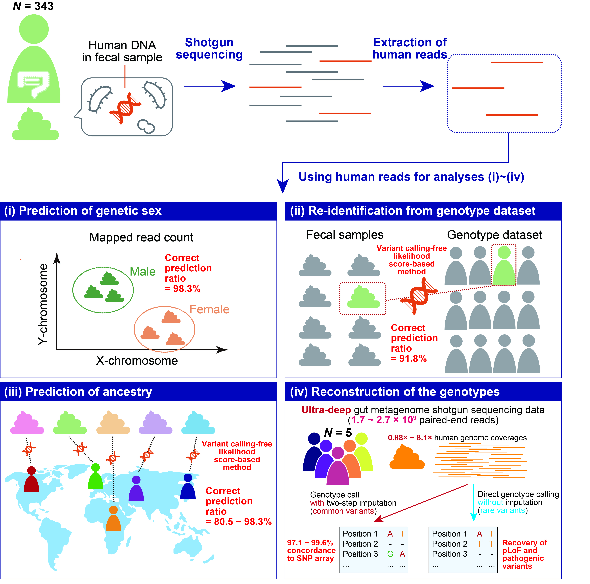
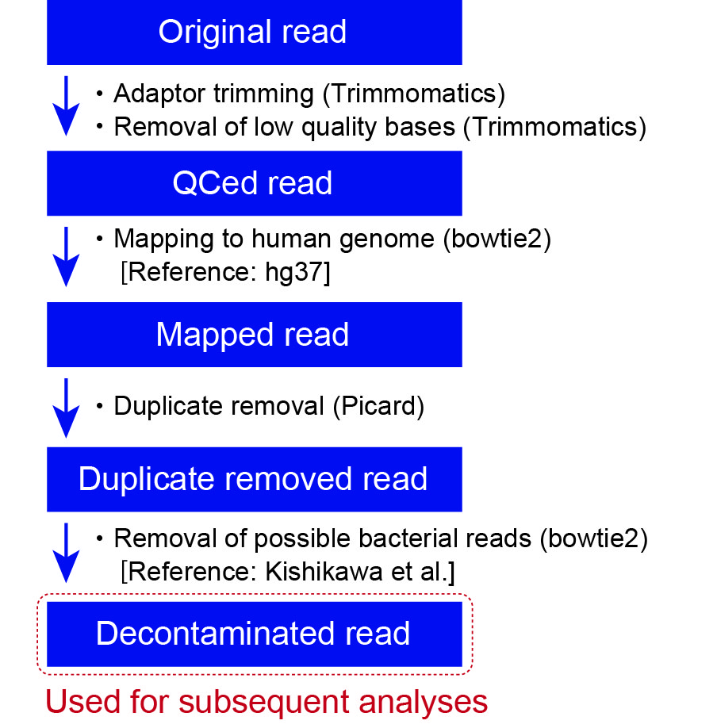
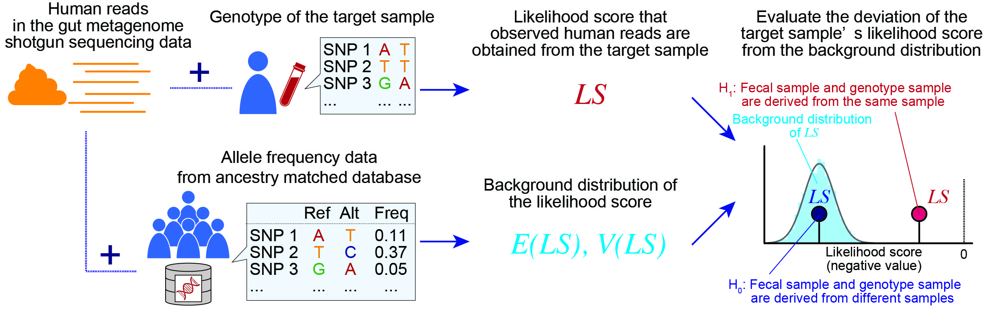
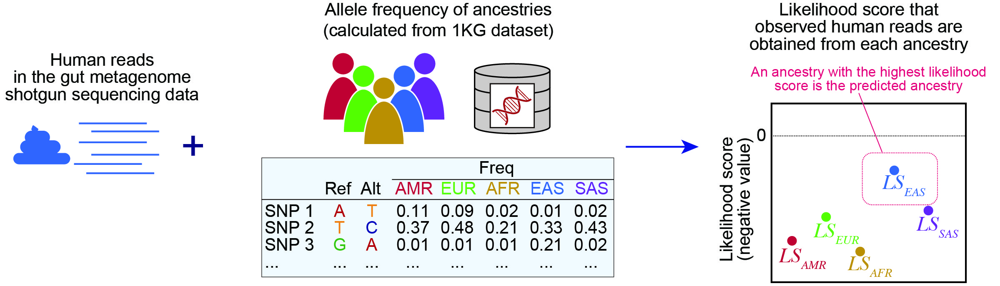

# Analysis of the human reads in gut metagenome shotgun sequencing data
This is a fork of the repository of the codes used in the Tomofuji et al (Reconstruction of the personal information from the contaminated human reads in the gut metagenome shotgun sequencing data).  
Aim is to recover following information from the human reads in the metagenome shotgun sequencing data  
・Genetic sex of the metagenome shotgun sequencing data  
・Find out whether samples are obtained from the same individual

# Prepare for running PIPELINE 1a + 1b

## Software
・singularity, build .sif files:

```
# One container for cleaning reads, extracting human reads (masked overlap with microbial similar regions)
singularity build cleanreads.sif docker://chvav/cleanreads@sha256:b8803f1bdb8a91b76286a5d26b38c9b068120869f6bf829c000d3364a6933359

# Bowtie 2 v2.3.4.1 and samtools v1.7
singularity build bowtie2_samtools.sif docker://davelabhub/bowtie2_plus_samtools@sha256:04afb9762780dcac25ebd1947c2e12ef81f96a51604dcaed5fb2081804051108

# Picard v2.21.5
singularity build ./picard.sif docker://pegi3s/picard@sha256:927475a7ade08cb9376127f04d410a9c78bf7f4fd9a6791363ceed68cd8aac74

# bedtools v2.30.0
singularity build ./bedtools.sif docker://pegi3s/bedtools@sha256:fc96153f83e4c69d742ee9b2bde33d5d297ef83b0a9b2d81ae32e14e26deb8fc

# GATK 4.1.4.1
singularity build ./gatk-4.sif docker://pegi3s/gatk-4@sha256:8415200fe87b4d4eb295e9decb207727e9f75aad73c860a8d0ffe3385a8eaa7a

# plink 1.9
singularity build ./plink.sif docker://biocontainers/plink1.9@sha256:17e280b12dd9101afa2f9a49e8dcf2b1bd2ac34380c21d8e4e677ffbc5dbbe27

# bcftools 1.21
sudo singularity build ./bcftools.sif docker://staphb/bcftools@sha256:c256fe5b7f8a216c517c2c6ff8fd68a6643ee614e93eedd181aa2c53600ec209

```

## Files

Download the bbduk provided file with Illumina adaptor and contaminant sequences (PhiX spike in control):
```
wget https://raw.githubusercontent.com/BioInfoTools/BBMap/master/resources/adapters.fa
```

Download the version human reference genome, masked for regions that may be similar to microbial genomes (https://www.seqanswers.com/forum/bioinformatics/bioinformatics-aa/37175-introducing-removehuman-human-contaminant-removal#post245912):
https://drive.google.com/file/d/0B3llHR93L14wd0pSSnFULUlhcUk/edit?resourcekey=0-PsIKmg2q4EvTGWGOUjsKGQ

This file will be used for initial extraction of the human reads.

Index the file:
```
singularity exec cleanreads.sif bbmap.sh ref=hg19_main_mask_ribo_animal_allplant_allfungus.fa.gz
```

Download the human reference genome and index for final mapping:

```
wget ftp://ftp.1000genomes.ebi.ac.uk/vol1/ftp/technical/reference/human_g1k_v37.fasta.gz
singularity exec bowtie2_samtools.sif bowtie2-build human_g1k_v37.fasta.gz human_g1k_v37
```
Save a nonpar.bed file (3 columns, tab-seperated) with the non-pseudoautosomal regions of the XY chromosomes (corresponding to GRCh37/hg19):
X       2699521 154931043
Y       2649521 59034049

# 1. Extraction of the human reads and prediction of genetic xex

Try out prediction of genetic sex on human reads already extracted with a different method

## Clean reads and extract human reads

```
chmod u+x PIPELINE_1a_cleanreads.sh
./PIPELINE_1a_cleanreads.sh <DIR_IN> <DIR_OUT>
```

## Predict sex

```
chmod u+x PIPELINE_1b_predict_sex.sh
./PIPELINE_1b_predict_sex.sh <DIR_IN> <DIR_OUT>
```


# Overview original repo
<div align="center">

</div>

# Requirements
・bcftools (version 1.15.1)   
・beagle4.1 (27Jan18)   
・beagle5.1 (18May20)   
・bedtools (version 2.29.2)  
・bowtie2 (version 2.3.5.1)  
・fastqc (version 0.11.9)  
・GATK (version 4.1.7)   
・Picard (version 2.22.8)  
・plink (version 1.90b4.4)  
・python3 (version 3.7.6)  
・R (version 4.0.1)  
・samtools (version 2.3.5.1)   
・tidyverse (version 1.3.0)  
・Trimmomatic (version 0.39)  

# 1. Extraction of the human reads and prediction of genetic sex
<div align="center">

</div>

First, human reads were extracted from gut metagenome shotgun sequencing data with the script `PIPELINE_1_human_read_extraction.sh`.  
Input file should be named as `${ID}_R1.fastq.gz` and `${ID}_R2.fastq.gz`  

Following variables are required:  
`BED_OF_NONPAR`: bed file for non-pseudoautosomal region (non-PAR) of the X and Y chromosomes  
`BOWTIE2_REF_BAC`: reference file for bowtie2 (bacteria)  
`BOWTIE2_REF_HUM`: reference file for bowtie2 (human, ex: hg37_1kg_decoy)  
`DIR`: Directory for analysis  
`FASTQ_DIR`: Directory of original fastq file  
`ID`: Sample ID   
`TRIM_ADAPT`: adaptor-sequence (ex: TruSeq3-PE-2.fa)  

This script outputs human reads in the metagenome shotgun sequencing data (`non_bacterial_${ID}_mapped.bam`) which can be used in the subsequent analyses.
In addition, coverages of the non-PAR of X and Y chromosomes are output into `bedcov_${ID}_nonPAR_XY.txt`, which can be used to predict genetic sex of the metagenome shotgun sequencing data.

# 2. Re-identification from a set of genotype data
<div align="center">

</div>

Likelihood scores for each metagenome shotgun sequencing data were calculated with the script `PIPELINE_2_likelihood_reidentification_test.sh`. The likelihood score reflects the likelihood that the observed human reads in the gut MSS data are derived from the target genotype data in `GENOME_FILE`. The inputs are (i) human reads in metagenome shotgun sequencing data (ii) target genotype data, and (iii) ancestry matched reference genome data.  

Following variables are required:  
`DIR`: Directory for analysis  
`GENOME_FILE`: Vcf file for genotype dataset for which the likelihood score is calculated  
`ID`: Sample ID   
`REFERENCE_PANEL`: Vcf file for reference genotype data  
`REF_FASTA`: reference genome file (ex: hg37_1kg_decoy)  
`REF_PLINK`: Plink file for reference genotype data  
`VCF_NAME`: Name of the vcf file added to the output filename  

This script outputs likelihood score for each pair of the metagenome shotgun sequencing data and target genotype data.
The columns of the `${ID}_likelihood_p_val_result.txt` indicate following values

`ID`: Sample ID of the target genotype data   
`Score`: Lilelihood score  
`EMP_P`: Empilically caluclated P-values   
`ANA_p`: P-values analytically calculated from the standardized likelihood score  
`RANK`: Rank of the likelihood score among the genotype dataset  
`ID_MATCH`: Whether the ID of the metagenome shotgun sequencing data is matched to that of the target genotype data  

# 3. Prediction of the ancestry
<div align="center">

</div>

Likelihood scores for each metagenome shotgun sequencing data were calculated with the script `PIPELINE_3_likelihood_test_ancestry.sh`. The likelihood score reflects the likelihood that the observed human reads in the gut MSS data are derived from the specified ancestries (`AMR, AFR, EUR, EAS, SAS` in this study). The inputs are (i) human reads in metagenome shotgun sequencing data and (ii) reference genome data (1000 Genome Project).  
 

Following variables are required:  
`DIR`: Directory for analysis  
`ID`: Sample ID   
`OKG_REF_DIR`: Directory for the 1KG reference data   
`REF_FASTA`: reference genome file (ex: hg37_1kg_decoy)   

Following files should be in `OKG_REF_DIR`   
1. ALL_POP.chr{1-22}.freq.chr.pos.gz

|  CHR  |  POS |  REF  |  ALT |  ID  |  AMR |  AFR  |  EUR |  EAS  |  SAS  |
| --- | --- | --- | --- | --- | --- | --- | --- | --- | --- |
|  22  |  16050075 |  A  |  G |  rs587697622  |  0 |  0  |  0 |  0  |  0.001022  |
|  22  |  16050115 |  G  |  A |  rs587755077  |  0.001441 |  0  |  0.02345 |  0  |  0 |
|  ...  |  ... |  ...  |  ... |  ...  |  ... |  ...  |  ... |  ...  |  ... |

`CHR`: Chromosome
`POS`: Position
`REF`: Reference allele
`ALT`: Alternative allele  
`ID`: SNP ID
`AMR`-`SAS`: Allele frequency in each ancestry


2. 1KG_CHR_POS_REF_ALT_sorted.txt (sorted based on the CHR:POS)

|  CHR:POS |  REF  |  ALT |
| --- | --- | --- |
|  chr10:100000003  |  C  |  T  |
|  chr10:10000001  |  C  |  T  |
|  ...  |  ... |  ...  | 

`CHR:POS`: Chromosome:Position
`REF`: Reference allele
`ALT`: Alternative allele  

The output is written to `${ID}_population_likelihood_result.txt` and each columun indicates following values

`Sample_ID`: Sample ID of the metagenome shotgun sequencing data  
`USED_BASE_NUM`: Number of the bases used for the analysis   
`{AMR, EUR, AFR, EAS, SAS}_LIK`: Likelihood score for each ancestry   
`TOP_POP`: The population with the highest likelihood score    

# 4. Reconstruction of the genotypes

Reconstruction of the genotypes from the gut metagenome shotgun sequencing data was performed with two complementary methods, namely two-step inputation (`PIPELINE_4_ldWGS_two_step_imputation.sh`) and direct genotype calling (`PIPELINE_5_variant_call_GATK.sh`). We performed two-step imputation as described in the Homburger et al. (https://doi.org/10.1186/s13073-019-0682-2). Direct genotype calling was performed basically as described in the GATK Best Practices Workflows (https://gatk.broadinstitute.org/hc/en-us/articles/360035535932-Germline-short-variant-discovery-SNPs-Indels-).

## Contact
Yoshihiko Tomofuji: ytomofuji_at_sg.med.osaka-u.ac.jp
